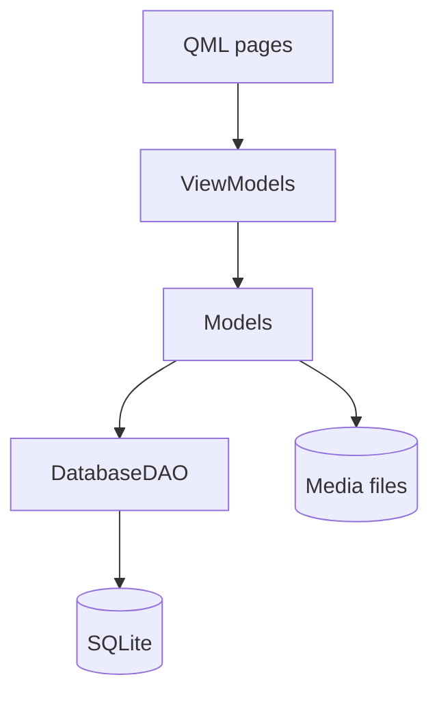

[TOC]

# Aurora Notes

A notes app for **Aurora OS** (and **Sailfish OS**), written in C++/Qt 5 and QML with Sailfish Silica. It keeps three kinds of notes in one list:

- **text notes**: a title and free-form text;
- **sketch notes**: freehand drawings made with your finger, saved as PNG images;
- **audio notes**: voice recordings made with the microphone, saved as WAV files, with playback in the app.

It is translated into English and Russian and distributed under the BSD-3-Clause license.

## Features

The application has the following features:

- one main screen shows every note as a thumbnail in a two-column grid, newest changes first;
- create a note with the buttons in the footer (pen, marker or tape);
- edit a note's title and content, or delete the note;
- record, play, pause and mute audio notes.

## Architecture

The app follows an MVVM layout. The view is made of QML pages and reusable QML elements. View models are exposed to QML as context properties, named with an underscore prefix (e.g. `_listViewModel`). Models contain the business logic and handle media files. The DAO is an abstraction layer over SQLite access; it emits signals when records are inserted, updated or removed. DTOs are plain data structures passed between the DAO, models and view models.



### Data storage

All data lives under `~/Documents/notes/`.

`notes.sqlite` contains the index of all notes. The `media` table holds `id, type, title, media (file path), created, modified`. Note content is kept in a separate file, and the database stores only that file's path.

```
notes/
├── notes.sqlite
├── text/<uuid>.txt
├── sketch/<uuid>.png
└── audio/<uuid>.wav
```

### Project structure

Source code is located in the `src` directory and is organized by function:

- `dao/*` CRUD data access layer on top of the SQLite `media` table;
- `dto/*` data transfer objects such as `TextNote`, `SketchNote`, `AudioNote`;
- `models/*` per-type models that read and write the media file and update the DB row;
- `viewmodels/*` a `QAbstractListModel` for the grid plus one view model per note type, all derived from `NoteViewModel`;
- `qmlitems/sketchitem.*` a `QQuickPaintedItem` drawing canvas exposed to QML;
- `audiorecorder.*` a `QAudioRecorder` set to record PCM/WAV;
- `main.cpp` starts the app, registers QML types and wires models to view models.

QML sources are located in the `qml` directory:

- `pages/*` UI pages;
- `elements/*` reusable QML elements shared across pages;
- `cover/*` the cover shown in the app switcher;
- `icons/*` SVG icons used by the UI.

Other files:

- `translations/*` Qt Linguist `.ts` files (`notes.ts` and `notes-ru.ts`). CMake updates them from the C++ and QML sources and compiles them to `.qm` at build time;
- `rpm/*` RPM spec and changelog templates.

## Building

### Requirements

To build the application you need:

- **Aurora OS** SDK or **Sailfish OS** SDK;
- CMake ≥ 3.5;
- a C++17 compiler;
- Qt 5: Core, Network, Qml, Gui, Quick, Sql, Multimedia, LinguistTools;
- `auroraapp` (**Aurora OS**) or `sailfishapp` (**Sailfish OS**), found through `pkg-config`.

## Permissions

The app asks for these permissions in its `.desktop` file: `SecureStorage`, `Audio`, `Documents`, `MediaIndexing` and `Microphone`.
