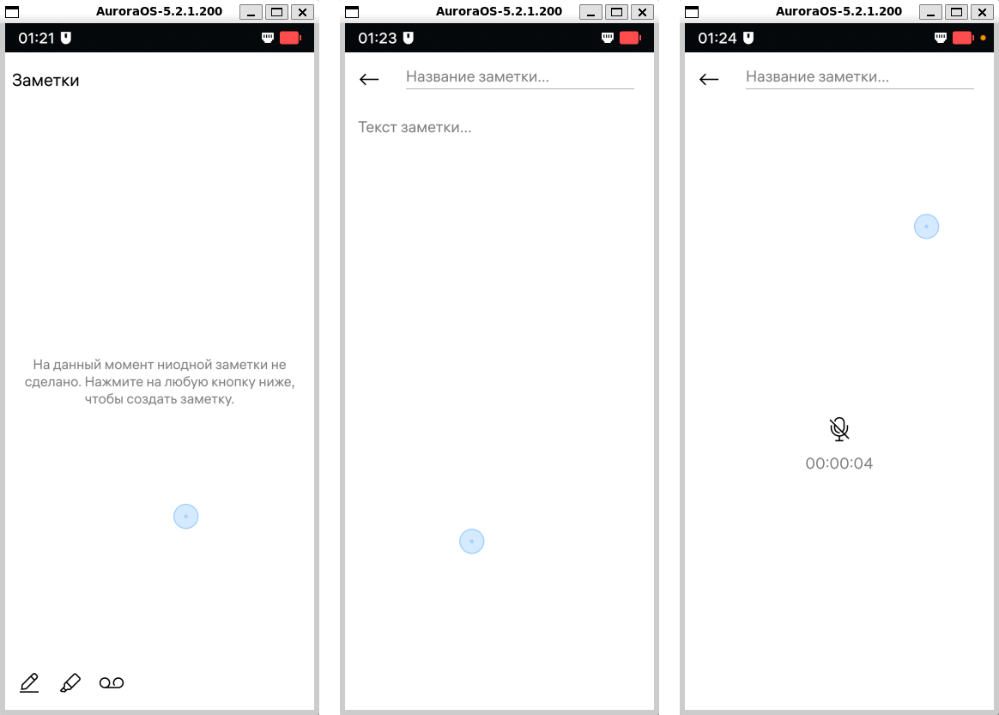
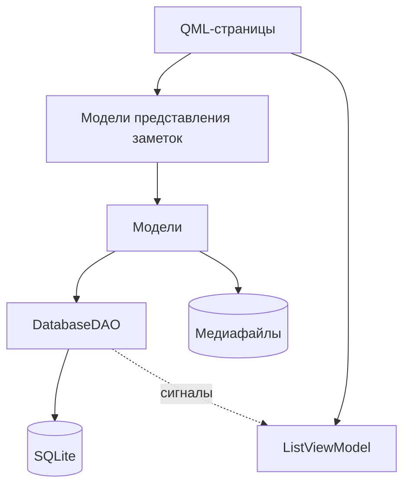

[TOC]

# Aurora Notes

[English](README.md) | **Русский**

Приложение для заметок под **ОС Аврора** (и **Sailfish OS**), написанное на C++/Qt 5 и QML с использованием Sailfish Silica. Оно хранит три вида заметок в одном списке:

- **текстовые заметки**: заголовок и произвольный текст;
- **рисунки**: рисунки от руки, сделанные пальцем и сохраняемые как изображения PNG;
- **аудиозаметки**: голосовые записи с микрофона, сохраняемые как файлы WAV, с воспроизведением в приложении.

Приложение переведено на английский и русский языки и распространяется под лицензией BSD-3-Clause.

## Скриншоты



## Возможности

Приложение обладает следующими возможностями:

- на главном экране все заметки отображаются миниатюрами в сетке из двух колонок, недавно изменённые — первыми;
- создание заметки кнопками внизу экрана (ручка, маркер или кассета);
- редактирование заголовка и содержимого заметки или её удаление;
- запись, воспроизведение, пауза и отключение звука для аудиозаметок.

## Архитектура

Приложение построено по схеме MVVM:

- представление состоит из QML-страниц и переиспользуемых QML-элементов;

- модели представления доступны в QML как контекстные свойства, их имена начинаются с подчёркивания (например, `_listViewModel`);

- модели содержат бизнес-логику и работают с медиафайлами;

- DAO — слой абстракции над доступом к SQLite; он отправляет сигналы при вставке, изменении или удалении записей;

- DTO — простые структуры данных, которые передаются между DAO, моделями и моделями представления.



### Хранение данных

Все данные хранятся в `~/Documents/notes/`.

`notes.sqlite` содержит индекс всех заметок. Таблица `media` хранит поля `id, type, title, media (путь к файлу), created, modified`. Содержимое заметки хранится в отдельном файле, а в базе данных — только путь к нему.

```
notes/
├── notes.sqlite
├── text/<uuid>.txt
├── sketch/<uuid>.png
└── audio/<uuid>.wav
```

### Структура проекта

```
aurora-notes/
├── icons/          # иконки приложения
├── qml/            # интерфейс
├── rpm/            # упаковка
├── screenshots/
├── src/            # исходники C++
└── translations/   # файлы .ts
```

Исходный код находится в каталоге `src` и разделён по назначению:

- `dao/*` — слой доступа к данным (CRUD) поверх таблицы SQLite `media`;
- `dto/*` — объекты передачи данных, например `TextNote`, `SketchNote`, `AudioNote`;
- `models/*` — модели для каждого типа заметок, которые читают и записывают медиафайл и обновляют строку в БД;
- `viewmodels/*` — `QAbstractListModel` для сетки и по одной модели представления на каждый тип заметок, все унаследованы от `NoteViewModel`;
- `qmlitems/sketchitem.*` — холст для рисования на основе `QQuickPaintedItem`, доступный в QML;
- `audiorecorder.*` — `QAudioRecorder`, настроенный на запись в PCM/WAV;
- `main.cpp` — запускает приложение, регистрирует QML-типы и связывает модели с моделями представления.

QML-исходники находятся в каталоге `qml`:

- `pages/*` — страницы интерфейса;
- `elements/*` — переиспользуемые QML-элементы, общие для страниц;
- `cover/*` — обложка, показываемая в переключателе приложений;
- `icons/*` — SVG-иконки интерфейса.

Прочие файлы:

- `translations/*` — файлы Qt Linguist `.ts` (`notes.ts` и `notes-ru.ts`). CMake обновляет их по исходникам C++ и QML и компилирует в `.qm` при сборке;
- `rpm/*` — spec-файл RPM и шаблоны журнала изменений.

## Сборка

### Требования

Для сборки приложения необходимы:

- SDK **ОС Аврора** или SDK **Sailfish OS**;
- CMake ≥ 3.5;
- компилятор с поддержкой C++17;
- Qt 5: Core, Network, Qml, Gui, Quick, Sql, Multimedia, LinguistTools;
- `auroraapp` (**ОС Аврора**) или `sailfishapp` (**Sailfish OS**), находимые через `pkg-config`.

## Разрешения

Приложение запрашивает следующие разрешения в своём `.desktop`-файле: `SecureStorage`, `Audio`, `Documents`, `MediaIndexing` и `Microphone`.
